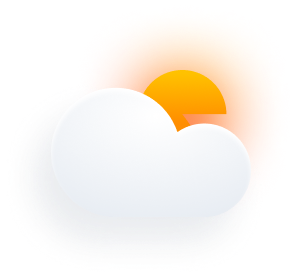
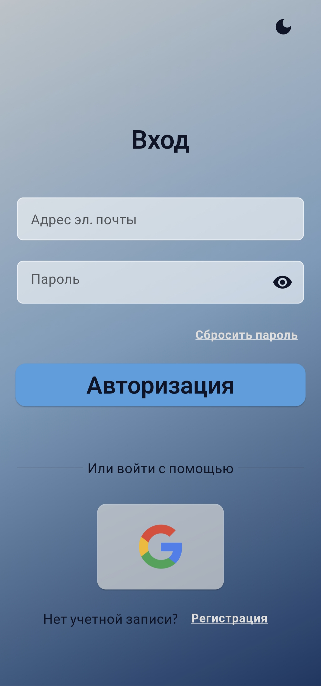
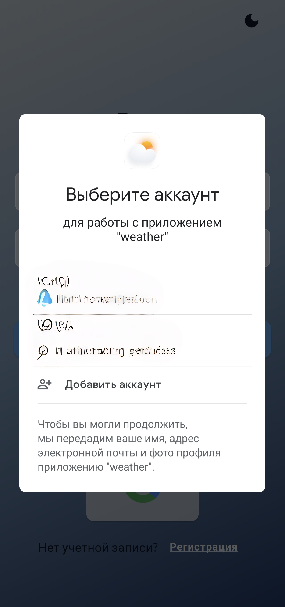
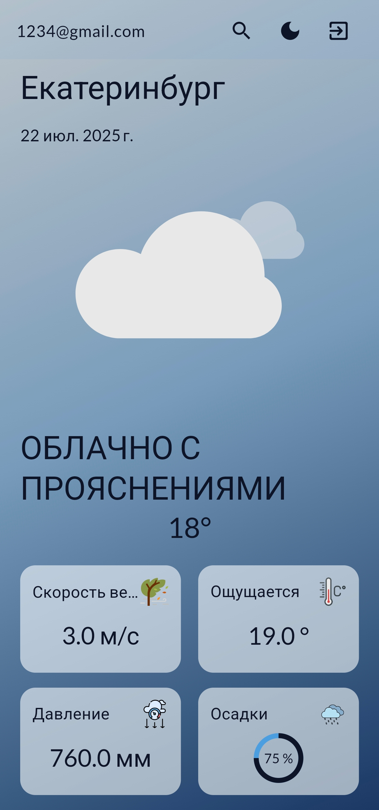
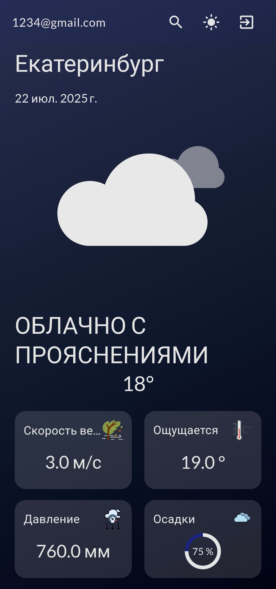
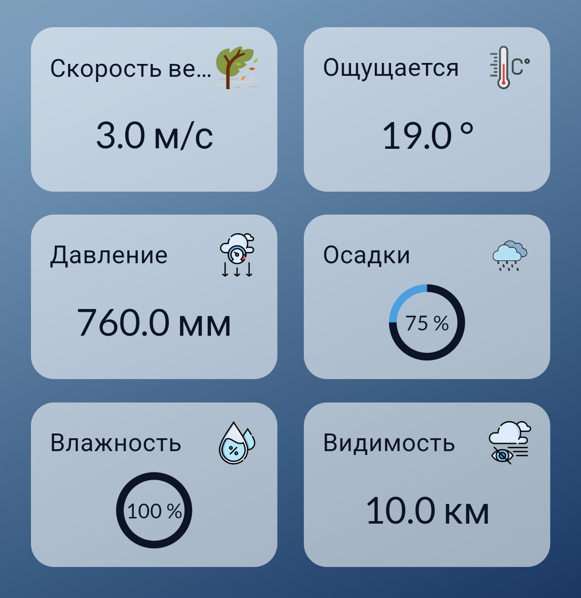

# Weather App

Мобильное приложение для просмотра погоды, разработанное на Flutter. Приложение позволяет пользователям просматривать текущую погоду в любом городе с красивой анимацией и удобным интерфейсом.

## 📱 Скриншоты

  
  
  
  
  
  
  
  

## ✨ Особенности

- 🌤 Просмотр текущей погоды
- 🏙 Поиск погоды по городам
- 🌓 Поддержка светлой и темной темы
- 🔐 Авторизация через Email и Google
- 💾 Сохранение последнего города
- 🎨 Красивые анимации погодных условий
- 📱 Адаптивный дизайн

## 🛠 Технологии

- Dart
- Flutter
- GetX для управления состоянием
- Firebase Authentication
- OpenWeather API
- Lottie для анимаций
- SharedPreferences для локального хранения

## 🚀 Установка

1. Клонируйте репозиторий
  git clone https://github.com/biteX0/weather_app.git

2. Перейдите в директорию проекта
   cd weather_app

3. Установите зависимости
   flutter pub get

4. Запустите приложение
   flutter run

## 🔄 Состояние приложения

Управление состоянием реализовано с помощью GetX:
- Реактивные переменные
- Сервисы для бизнес-логики
- Контроллеры для управления экранами

## 🎨 Темизация

Приложение поддерживает светлую и темную темы:
- Автоматическое переключение
- Сохранение выбранной темы
- Кастомные цвета и стили

## 🔐 Авторизация

Реализована авторизация через:
- Email/Password
- Google Sign-In
- Сброс пароля

## 📡 API

Приложение использует OpenWeather API для получения данных о погоде:
- Текущая погода
- Описание погоды
- Температура
- Влажность
- Скорость ветра

## 👥 Авторы

- [@biteX0](https://github.com/biteX0)
